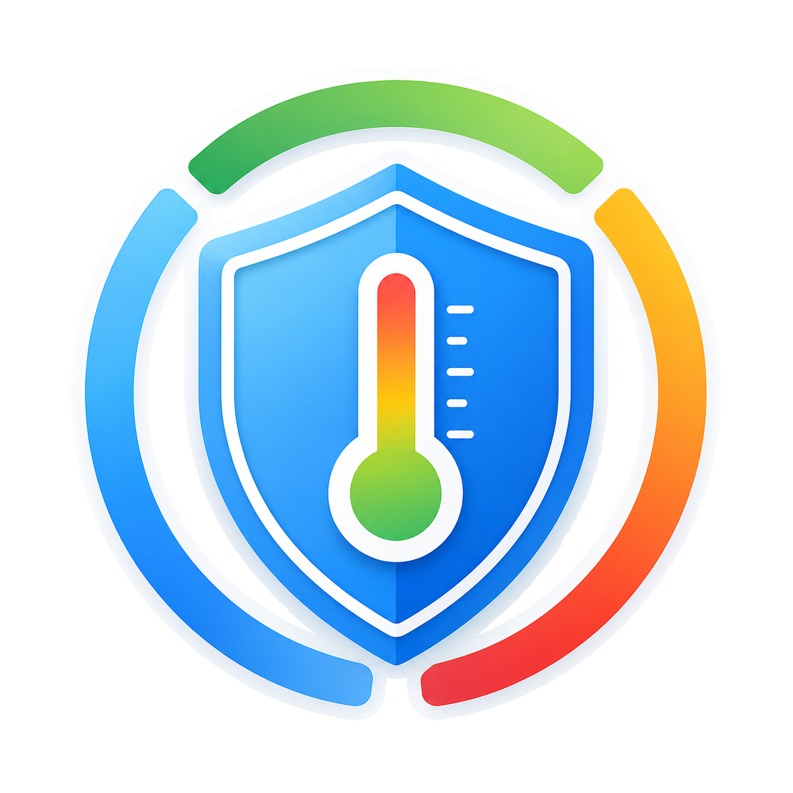
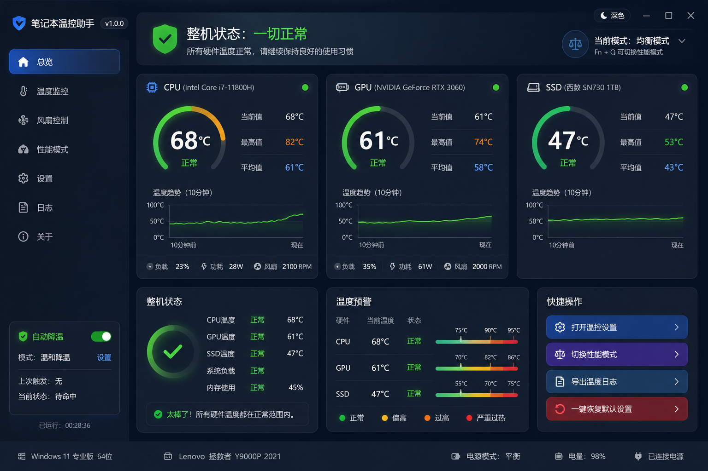
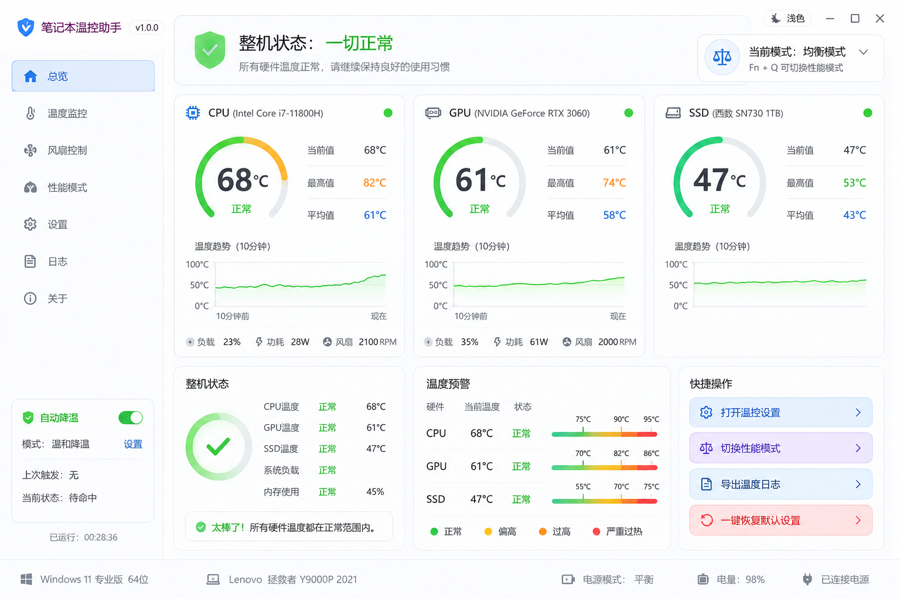

<p align="center">
  
</p>

<h1 align="center">笔记本温控助手</h1>

<p align="center">面向 Windows 11 的本地 CPU、GPU 与 SSD 温度监控工具：用中文状态、趋势与预警，让硬件状态更容易看懂。</p>

<p align="center"><a href="#笔记本温控助手">简体中文</a> · English（计划中）</p>

<p align="center"><a href="#用户指南">用户指南</a> · <a href="#开发者指南">开发者指南</a> · <a href="#致谢">致谢</a> · <a href="#许可证">许可证</a> · <a href="#免责声明">免责声明</a></p>

## 用户指南

### 它能做什么

- 显示 CPU、GPU、SSD 的当前温度、运行期最高值、平均值和最近 10 分钟趋势；温度等级同时以颜色和中文文字呈现。
- 依据内置阈值状态机提供“正常、温度偏高、温度过高、严重过热”参考状态，包含升级延迟与迟滞恢复，避免瞬时波动造成频繁跳变。
- 默认以 Mock 数据运行，便于体验仪表盘和预警状态；使用 `--real-hardware` 时，通过 [LibreHardwareMonitor](https://github.com/LibreHardwareMonitor/LibreHardwareMonitor) 只读采集 CPU、GPU、SSD 传感器。
- 每 5 秒在本机记录 CSV 温度历史，并可把日文件合并导出；缺失传感器字段保持为空，不会伪装成 `0`。
- 提供总览、温度监控、风扇控制、性能模式、设置、日志和关于页。除总览、采样和 CSV 历史外，其余页面当前主要是可交互的安全 Mock／演示壳：可切换和查看演示状态，但不会写入 Windows 电源设置，也不会调用 Fn+Q、EC、BIOS 或风扇控制接口。

### 获取与构建

当前仓库尚未提供预编译 Release 下载，请从源码构建。开发与验证目标为 **Windows 11 x64**，需要安装 **.NET 10 SDK**（仓库以 `global.json` 固定 `10.0.100` 基线）和 Git。

```powershell
git clone --recurse-submodules https://github.com/RoamerFly/laptop_t_helper.git
cd laptop_t_helper
.\build.bat
```

若仓库已克隆但未带子模块，先执行：

```powershell
git submodule update --init --recursive
.\build.bat
```

`build.bat` 会还原依赖、构建 Release、运行测试，并发布自包含的 Windows x64 程序到 `dist_windows`：

```powershell
.\dist_windows\LaptopThermalHelper.App.exe
```

### 基本使用

1. 直接启动程序时使用默认 Mock 数据；CPU、GPU、SSD 温度会按预设场景变化，用于检查状态、仪表和趋势表现。
2. 需要读取本机硬件时，从命令行传入 `--real-hardware`。某些设备或传感器在管理员权限下才能完整读取；不可用数据会显示 `--`，未开放的风扇转速显示“未开放”。
3. 通过左侧导航切换各页面。温度监控页的时间范围、性能策略、通知/阈值输入、日志筛选等控件都可交互，但属于演示会话；它们不会改变硬件或系统设置。
4. 在总览或日志页选择“导出温度日志”，将本地日 CSV 合并到导出目录。历史数据默认位于 `%LocalAppData%\RoamerFly\LaptopThermalHelper\history\`，导出文件位于同级 `exports\`。
5. 单击标题栏并拖动可移动窗口；双击标题栏可在最大化和还原之间切换。传入 `--light-theme` 可用浅色主题启动。

以真实硬件采集模式启动：

```powershell
.\dist_windows\LaptopThermalHelper.App.exe --real-hardware
```

以浅色主题启动：

```powershell
.\dist_windows\LaptopThermalHelper.App.exe --light-theme
```

### 设计预览

以下为仓库中的设计基准图，而非对实时硬件读数的承诺。总览页以此为视觉验收参考。

#### 深色设计图



#### 浅色设计图



### 安全与隐私

- 默认模式不读取真实传感器；`--real-hardware` 仅用于读取传感器。程序不上传遥测或硬件历史数据，CSV、日志和导出内容均保留在本机用户目录。
- 本版本**没有**风扇直控、EC 读写、BIOS 修改、Fn+Q 模拟、超频、降压或自动关机功能；界面中的自动降温和性能策略为安全 Mock，不会修改 Windows 电源计划或处理器限制。
- 真实传感器是否可用、读数是否完整，受设备、BIOS、EC、驱动与固件影响。温度等级只是应用级参考，并不等同于厂商限制、TJmax、保修标准或绝对安全边界。
- CSV 记录含时间戳、设备名称及温度/负载/功耗/风扇等硬件读数；共享导出文件前请自行核查其内容。

## 开发者指南

### 环境

- Windows 11 x64
- .NET 10 SDK（`global.json`：`10.0.100`，允许使用更新功能版本）
- Git；首次从源码构建时需要初始化 LibreHardwareMonitor 子模块

项目采用 C#、WPF、.NET 10、MVVM 和分层架构。硬件适配使用 LibreHardwareMonitorLib，图表使用 LiveCharts2 WPF，应用宿主使用 Microsoft.Extensions.Hosting，日志使用 Serilog，测试使用 xUnit。

### 常用命令

```powershell
# 还原、构建与测试
dotnet restore .\LaptopThermalHelper.sln
dotnet build .\LaptopThermalHelper.sln --configuration Release --no-restore
dotnet test .\LaptopThermalHelper.sln --configuration Release --no-build

# 检查自有代码格式（上游 LibreHardwareMonitor 保持原始源码格式）
dotnet format .\LaptopThermalHelper.sln --verify-no-changes --exclude LibreHardwareMonitor

# 推荐的一键构建、测试与发布
.\build.bat
```

### 打包

推荐使用根目录的 `build.bat`。它会检查兼容的 .NET 10 SDK、在需要时初始化 LibreHardwareMonitor 子模块、执行 Release 构建和测试，再以 `win-x64`、自包含方式发布到 `dist_windows`。发布目录会带上本项目许可证及第三方许可证声明。

需要手动发布时，可执行：

```powershell
dotnet publish .\src\LaptopThermalHelper.App\LaptopThermalHelper.App.csproj `
  --configuration Release `
  --runtime win-x64 `
  --self-contained true `
  -p:Platform=x64 `
  --output .\dist_windows
```

### 项目结构

```text
laptop_t_helper/
├─ src/
│  ├─ LaptopThermalHelper.App/          # WPF 窗口、主题、控件与 ViewModel
│  ├─ LaptopThermalHelper.Application/  # 采样协调与历史用例
│  ├─ LaptopThermalHelper.Core/         # 领域模型、阈值、状态机与统计
│  ├─ LaptopThermalHelper.Hardware.Lhm/ # LibreHardwareMonitor 只读适配
│  └─ LaptopThermalHelper.Infrastructure/# CSV 历史、日志等基础设施
├─ tests/                               # xUnit 单元测试
├─ docs/                                # 图标与设计图
├─ LibreHardwareMonitor/                # 固定版本的上游子模块
├─ LICENSES/                            # 第三方许可证声明
├─ build.bat                            # Windows 一键构建与发布
```

### 相关文档

- [深色设计图](./docs/ui/笔记本温控助手设计图-深色.png)
- [浅色设计图](./docs/ui/笔记本温控助手设计图-浅色.png)
- [第三方组件声明](./LICENSES/THIRD-PARTY-NOTICES.md)

## 致谢

感谢以下开源项目及其维护者：

- [LibreHardwareMonitor](https://github.com/LibreHardwareMonitor/LibreHardwareMonitor) / LibreHardwareMonitorLib：硬件传感器读取。
- [CommunityToolkit.Mvvm](https://github.com/CommunityToolkit/dotnet)、[LiveCharts2](https://github.com/beto-rodriguez/LiveCharts2)、[Serilog](https://serilog.net/)：桌面应用的 MVVM、图表与日志基础设施。
- [.NET](https://dotnet.microsoft.com/) / [WPF](https://learn.microsoft.com/dotnet/desktop/wpf/) 与 [xUnit](https://xunit.net/)：运行时、桌面框架与测试支持。

精确依赖版本、用途与许可证见[第三方组件声明](./LICENSES/THIRD-PARTY-NOTICES.md)。

## 许可证

本项目原创代码使用 [MIT License](./LICENSE)。LibreHardwareMonitorLib 及其相关代码使用 [MPL-2.0](https://www.mozilla.org/MPL/2.0/)；其上游源码、固定提交和其他依赖声明见[第三方组件声明](./LICENSES/THIRD-PARTY-NOTICES.md)。

## 免责声明

笔记本温控助手是独立第三方开源项目，与 Lenovo、LEGION、Intel、NVIDIA、Microsoft、LibreHardwareMonitor 及其他硬件/软件厂商不存在官方隶属、授权、合作或背书关系。产品与商标名称仅用于说明兼容性，归各自权利人所有。

温度、负载、功耗与风扇读数来自操作系统、驱动和传感器接口，可能缺失、延迟或不准确；应用的状态标签不构成硬件安全、保修或性能判断依据。请结合设备厂商资料与实际情况判断。

软件按现状提供。使用、配置或依赖本软件产生的硬件损坏、系统不稳定、性能下降、数据丢失或其他损失，由使用者在适用法律允许的范围内自行承担风险。请在进行任何系统级调节前备份重要数据；当前版本不会实施 EC、BIOS、风扇或 Windows 电源设置修改。
