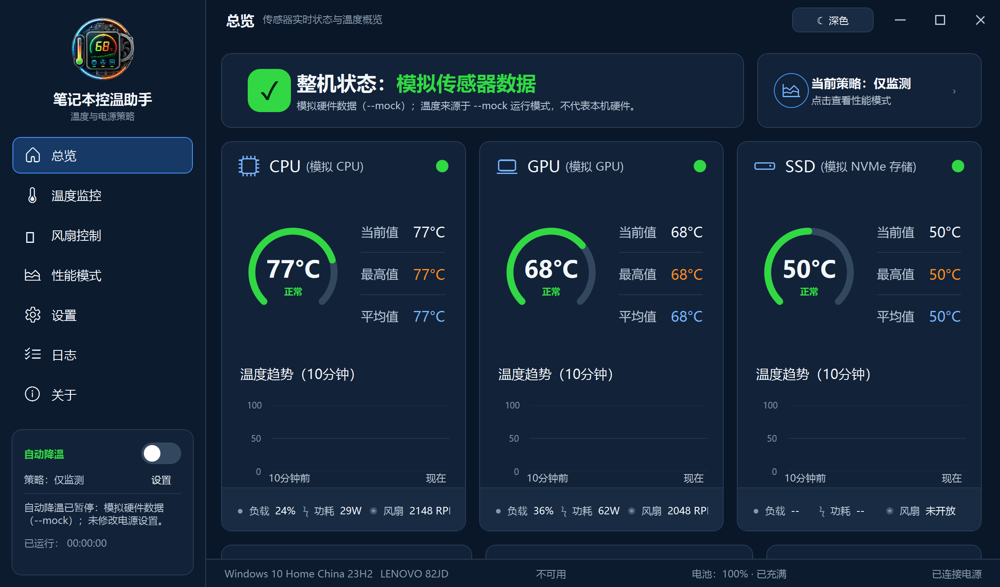
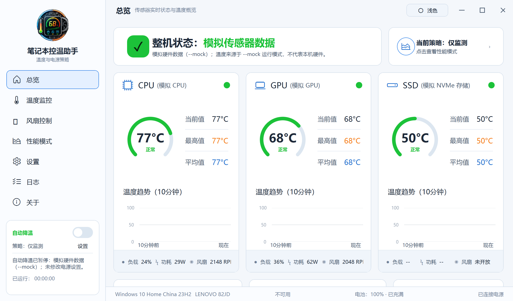

<p align="center">
  
</p>

<h1 align="center">笔记本温控助手</h1>

<p align="center">面向 Windows 11 的本地 CPU、GPU 与 SSD 温度监控工具：用中文状态、趋势和预警，让硬件状态更容易看懂。</p>

<p align="center"><a href="#笔记本温控助手">简体中文</a> · English（计划中）</p>

<p align="center"><a href="#用户指南">用户指南</a> · <a href="#开发者指南">开发者指南</a> · <a href="#致谢">致谢</a> · <a href="#许可证">许可证</a> · <a href="#免责声明">免责声明</a></p>

## 用户指南

### 它能做什么？

- 默认通过 [LibreHardwareMonitor](https://github.com/LibreHardwareMonitor/LibreHardwareMonitor) **只读**采集 CPU、GPU、SSD 传感器；可显示当前、最高、平均温度和中文状态。没有可用读数时显示 `--`，不会伪造为 `0`。
- 读取并显示真实的 Windows 系统信息：操作系统、厂商与机型、电池、电源来源和当前电源计划；信息不完整时明确标为不可用或部分可用。
- 温度详情提供 10 分钟、1 小时、6 小时、24 小时范围。历史保留在当前进程内，最长 24 小时；每个设备的图表最多绘制 360 个点，并可保存与导出本地 CSV 温度历史。
- 提供总览、温度监控、风扇控制、性能模式、设置、日志与关于页。风扇页为只读状态展示，直控风扇曲线处于禁用状态。
- 设置会安全持久化：采样间隔、温度阈值、通知、托盘行为、当前用户开机启动项等均可保存；损坏的设置文件会备份后自动回退到默认值。
- 支持关闭或最小化至通知区、托盘菜单显示/退出、温度状态提示，以及阈值跨越/严重过热通知。通知有冷却时间与去抖，系统不支持通知时会安全降级并记录应用事件。
- 日志页显示当前会话的应用事件，可筛选、导出 CSV 或仅清除显示；清除显示不会删除磁盘上的温度历史或导出的日志文件。
- 关于页显示应用真实版本与当前运行模式，并明确在线更新检查尚未接入。

### 获取与构建

当前仓库尚未提供预编译 Release 下载，请从源码构建。开发与验证目标为 **Windows 11 x64**，需要 **.NET 10 SDK**（仓库以 `global.json` 固定 `10.0.100` 基线）和 Git。

```powershell
git clone --recurse-submodules https://github.com/RoamerFly/laptop_t_helper.git
cd laptop_t_helper
.\build.bat
```

若仓库已克隆但缺少子模块：

```powershell
git submodule update --init --recursive
.\build.bat
```

`build.bat` 会还原依赖、构建 Release、运行测试，并发布自包含 Windows x64 程序到 `dist_windows`：

```powershell
.\dist_windows\LaptopThermalHelper.App.exe
```

### 构建与图标故障排除

`build.bat` 可直接从 `cmd.exe` 或 PowerShell 运行。

启用“最小化到托盘”后，点击窗口 `X` 可能仅将应用隐藏到通知区。更新图标或覆盖 `dist_windows` 前，请先在系统托盘右键应用图标并选择“退出”（或仅在任务管理器中结束属于自己的旧实例）；构建脚本只会检测并早停，不会强制结束进程。若 Windows 图标缓存没有立刻刷新，请先确认新 EXE 的 SHA/版本，再重启资源管理器；脚本不会清理系统图标缓存。

### 基本使用

1. 直接启动程序即以**真实硬件只读模式**运行，读取 CPU、GPU、SSD 传感器与 Windows 系统信息。部分设备或传感器在管理员权限下才可能提供更完整的读数；应用不会因此请求或静默提升权限。
2. 仅在需要演示界面或确定性数据时，追加 `--mock`：

   ```powershell
   .\dist_windows\LaptopThermalHelper.App.exe --mock
   ```

   `--real-hardware` 仅保留为旧命令兼容项，已废弃；真实只读硬件采集现在无需该参数，因此不作为推荐命令。
3. 通过左侧导航切换页面。温度详情范围、日志筛选、设置和托盘选项均可交互；设置保存后立即生效。
4. 默认关闭自动降温。用户在性能页主动启用后，服务仅在温度持续超过阈值时触发保守处理器降温，并在温度回落、用户禁用或应用退出时恢复原值。详见[安全与隐私](#安全与隐私)。
5. 在总览或日志页导出温度历史，在日志页导出应用事件。默认文件位置位于 `%LocalAppData%\RoamerFly\LaptopThermalHelper\` 下的 `history`、`exports` 等本地用户目录。
6. 单击标题栏并拖动可移动窗口；双击标题栏可在最大化与还原之间切换。追加 `--light-theme` 可用浅色主题启动：

   ```powershell
   .\dist_windows\LaptopThermalHelper.App.exe --light-theme
   ```

### 温度状态说明

以下是应用的**通用、保守默认值**，用于提示而不是宣称某一型号的硬性耐温上限；具体 CPU/GPU/SSD 应始终以设备厂商、OEM 和固件规格为准。

| 硬件类别 | 偏高 | 过高 | 严重过热 |
| --- | ---: | ---: | ---: |
| CPU | 85°C | 95°C | 100°C |
| GPU 核心温度 | 80°C | 87°C | 92°C |
| NVMe/SATA 存储当前/Composite 温度 | 60°C | 70°C | 80°C |

Intel 明确要求按具体处理器规格确认 Tjunction；NVIDIA 的最大核心温度也会随型号和厂商实现而变化。常见 NVMe 数据表的工作温度为 0–70°C，因此仅当传感器实际报告当前/Composite 温度时，75°C 会显示为“温度过高”。应用会排除 NVMe SMART 的 `Warning Temperature` 和 `Critical Temperature` 固定阈值，绝不将其中常见的 70°C/75°C 数值伪装成实时温度；没有有效传感器的设备会显示“不可用”。参考：[Intel 温度说明](https://www.intel.com/content/www/us/en/support/articles/000005597/processors.html)、[WD SN730 数据表](https://documents.westerndigital.com/content/dam/doc-library/en_us/assets/public/western-digital/product/data-center-drives/ultrastar-nvme-series/data-sheet-ultrastar-dc-sn730.pdf)、[Samsung 980 规格](https://semiconductor.samsung.com/emea/consumer-storage/internal-ssd/980/)。

### 界面预览

以下截图来自实际运行的 WPF 窗口（`--mock` 演示数据），用于展示应用的深浅主题、窗口控件与响应式布局；不代表本机真实硬件读数。

#### 深色主题



#### 浅色主题



### 设计参考

以下为仓库中的设计基准图，不代表每台设备都能提供相同的实时硬件读数。

#### 深色设计图


#### 浅色设计图


### 安全与隐私

- 默认真实硬件模式只读采集传感器与系统信息；`--mock` 才使用模拟数据。应用不会上传遥测、温度历史或系统信息，CSV、设置、日志和导出内容均保留在本地用户目录。
- 自动降温默认关闭，必须由用户主动开启。它只使用公开的 Windows `powercfg` 处理器电源管理能力，临时调整**当前电源计划**的处理器最大状态；触发前会保存原始交流/直流值，禁用、恢复条件满足或退出应用时会恢复。若恢复失败，应用会保留恢复记录、显示失败状态并写入应用日志。
- 自动降温不会调用或写入 EC、BIOS、厂商私有接口、Fn+Q、风扇控制接口，也不实施风扇直控、超频、降压或自动关机；不会静默提权。它不是任意风扇控制功能。
- 温度、负载、功耗和风扇读数是否可用受设备、BIOS、EC、驱动和固件影响。应用状态标签仅供参考，不等同于厂商限制、Tjmax、保修标准或绝对安全边界。
- 分享 CSV 或应用日志前，请自行检查其中的时间戳、设备名称和硬件读数等本地信息。

## 开发者指南

### 环境

- Windows 11 x64
- .NET 10 SDK（`global.json`：`10.0.100`，允许使用更新功能版本）
- Git；首次构建需要初始化 LibreHardwareMonitor 子模块

项目采用 C#、WPF、.NET 10、MVVM 与分层架构。硬件适配使用 LibreHardwareMonitorLib；图表使用 LiveCharts2 WPF；应用宿主使用 Microsoft.Extensions.Hosting；日志使用 Serilog；测试使用 xUnit。

### 常用命令

```powershell
# 还原、构建与测试
dotnet restore .\LaptopThermalHelper.sln
dotnet build .\LaptopThermalHelper.sln --configuration Release --no-restore
dotnet test .\LaptopThermalHelper.sln --configuration Release --no-build

# 检查自有代码格式（上游 LibreHardwareMonitor 保持原始格式）
dotnet format .\LaptopThermalHelper.sln --verify-no-changes --exclude LibreHardwareMonitor

# 推荐的一键构建、测试与发布
.\build.bat
```

当前测试共 **81** 项：Application 20、Core 28、Infrastructure 7、Hardware.Lhm 6、App 20。

### 打包

推荐使用根目录的 `build.bat`。它会检查兼容的 .NET 10 SDK、在需要时初始化 LibreHardwareMonitor 子模块、执行 Release 构建和 81 项测试，再以 `win-x64` 自包含方式发布到 `dist_windows`。发布目录会附带本项目许可证和第三方许可证声明。

需要手动发布时：

```powershell
dotnet publish .\src\LaptopThermalHelper.App\LaptopThermalHelper.App.csproj `
  --configuration Release `
  --runtime win-x64 `
  --self-contained true `
  -p:Platform=x64 `
  --output .\dist_windows
```

### 项目结构

```text
laptop_t_helper/
├── src/
│   ├── LaptopThermalHelper.App/           # WPF 窗口、服务、主题、控件与 ViewModel
│   ├── LaptopThermalHelper.Application/   # 采样协调、运行模式与进程内温度历史
│   ├── LaptopThermalHelper.Core/          # 领域模型、阈值、状态机与统计
│   ├── LaptopThermalHelper.Hardware.Lhm/  # LibreHardwareMonitor 只读适配
│   └── LaptopThermalHelper.Infrastructure/ # CSV 历史、Windows 系统信息等基础设施
├── tests/                                 # xUnit 单元测试
├── docs/                                  # 应用图标与设计图
├── LibreHardwareMonitor/                  # 固定版本的上游子模块
├── LICENSES/                              # 第三方许可证声明
└── build.bat                              # Windows 一键构建、测试与发布
```

### 相关文档

- [深色设计图](./docs/ui/笔记本温控助手设计图-深色.png)
- [浅色设计图](./docs/ui/笔记本温控助手设计图-浅色.png)
- [第三方组件声明](./LICENSES/THIRD-PARTY-NOTICES.md)

## 致谢

感谢以下开源项目及其维护者：

- [LibreHardwareMonitor](https://github.com/LibreHardwareMonitor/LibreHardwareMonitor) / LibreHardwareMonitorLib：硬件传感器只读采集。
- [CommunityToolkit.Mvvm](https://github.com/CommunityToolkit/dotnet)、[LiveCharts2](https://github.com/beto-rodriguez/LiveCharts2)、[Serilog](https://serilog.net/)：桌面应用的 MVVM、图表与日志基础设施。
- [.NET](https://dotnet.microsoft.com/) / [WPF](https://learn.microsoft.com/dotnet/desktop/wpf/) 与 [xUnit](https://xunit.net/)：运行时、桌面框架与测试支持。

精确依赖版本、用途与许可证见[第三方组件声明](./LICENSES/THIRD-PARTY-NOTICES.md)。

## 许可证

本项目原创代码使用 [MIT License](./LICENSE)。LibreHardwareMonitorLib 及其相关代码使用 [MPL-2.0](https://www.mozilla.org/MPL/2.0)；上游源码、固定提交和其他依赖声明见[第三方组件声明](./LICENSES/THIRD-PARTY-NOTICES.md)。

## 免责声明

笔记本温控助手是独立第三方开源项目，与 Lenovo、LEGION、Intel、NVIDIA、Microsoft、LibreHardwareMonitor 及其他硬件或软件厂商不存在官方隶属、授权、合作或背书关系。产品与商标名称仅用于说明兼容性，归各自权利人所有。

温度、负载、功耗与风扇读数可能缺失、延迟或不准确；应用状态标签不构成硬件安全、保修或性能判断依据。自动降温仅是可恢复的 Windows 处理器电源管理辅助功能，不替代厂商热管理策略。请结合设备厂商资料与实际情况判断，并在进行任何系统级调节前备份重要数据。

软件按现状提供。因使用、配置或依赖本软件产生的硬件损坏、系统不稳定、性能下降、数据丢失或其他损失，由使用者在适用法律允许的范围内自行承担风险。
